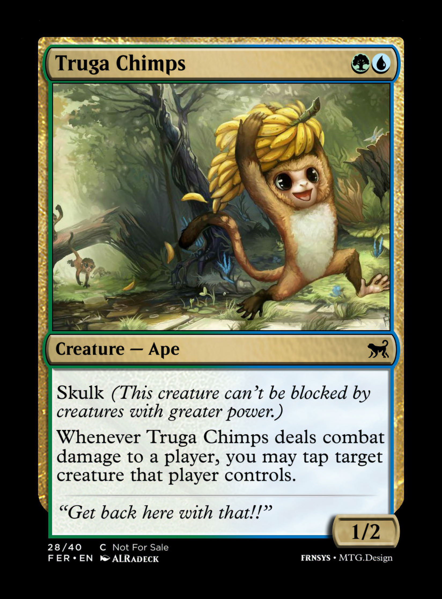

This is a script to process custom MTG card images from [mtg.design](https://mtg.design). It adds a sufficient bleed so that the printed cards images are roughly the same as official ones.

It's difficult to find MTG card design sites that generate high-res images suitable for printing (b/c people are worried about enabling forgeries/fraud). This system uses a super-resolution model ([Neural Enhance](https://github.com/alexjc/neural-enhance)) to upscale the generated cards.

I haven't yet printed cards generated using this system yet, after looking at the images the super-resolution is working well for text and symbols and in some cases works well for the card art as well.

# Setup

```
git clone git@github.com:alexjc/neural-enhance.git
cd neural-enhance
pip install -r requirements.txt
wget https://github.com/alexjc/neural-enhance/releases/download/v0.3/ne2x-photo-default-0.3.pkl.bz2
cd ..
```

## GPU setup for Theano

(Assuming you have CUDA setup already)

With your `virtualenv` activated:

```
git clone https://github.com/Theano/libgpuarray.git
cd libgpuarray/
mkdir Build
cd Build/
cmake .. -DCMAKE_BUILD_TYPE=Release
make
make install
sudo make install
cd ..
python setup.py build
python setup.py install

pip install -U theano==1.0.3
```

# Usage

Basic usage:

```
python prep_cards.py "<mtg.design set url>"
```

For example:

```
python prep_cards.py "https://mtg.design/u/frnsys/FER"
```

`neural-enhance` uses Theano, so you may want to specify some additional options for it, e.g.:

```
THEANO_FLAGS=device=cuda0,force_device=True,dnn.base_path=/usr/local/cuda python prep_cards.py "https://mtg.design/u/frnsys/FER"
```

Note: Using a GPU is highly recommended if you have access to one. The super-resolution processing can take quite a long time otherwise.

## Example image

